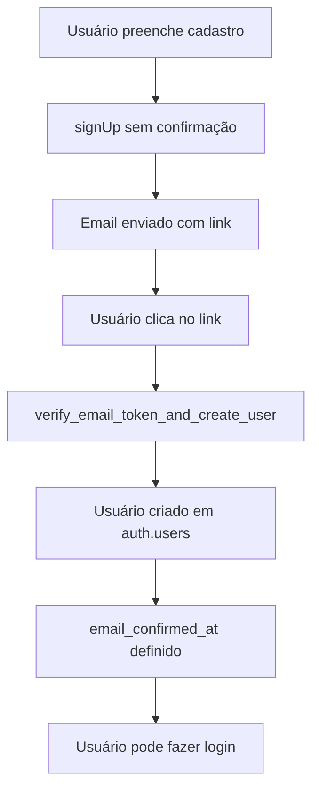

# Guia de Debug de Autenticação

## Problema Identificado

O sistema estava enfrentando um problema crítico no fluxo de autenticação onde:

1. ✅ Usuário conseguia completar o cadastro
2. ✅ Email de verificação era enviado e recebido
3. ✅ Usuário clicava no link de verificação
4. ✅ Confirmação era exibida
5. ❌ **PROBLEMA**: Usuário não conseguia fazer login posteriormente
6. ❌ **PROBLEMA**: Email ainda aparecia disponível para novo cadastro

## Causa Raiz

O problema estava na função RPC incorreta sendo chamada em `VerifyEmail.tsx`:

```typescript
// ❌ INCORRETO - Apenas verifica o token
const { data, error } = await supabase.rpc('verify_email_token', {
  p_token: verificationToken
});

// ✅ CORRETO - Verifica o token E cria o usuário
const { data, error } = await supabase.rpc('verify_email_token_and_create_user', {
  p_token: verificationToken
});
```

## Soluções Implementadas

### 1. Correção da Função RPC

**Arquivo**: `src/pages/VerifyEmail.tsx`
- Corrigida a chamada da função RPC de `verify_email_token` para `verify_email_token_and_create_user`
- Esta função não apenas verifica o token, mas também cria o usuário na tabela `auth.users`

### 2. Correção do emailRedirectTo

**Arquivo**: `src/hooks/useAuth.tsx`
- Alterado o `emailRedirectTo` de `/` para `/verify-email`
- Garante que o usuário seja redirecionado para a página correta após clicar no link

### 3. Funções RPC de Debug

**Arquivo**: `supabase/migrations/20250130000007_add_user_debug_functions.sql`

#### `debug_user_status(p_email TEXT)`
- Verifica se o usuário existe na tabela `auth.users`
- Retorna status de confirmação de email
- Útil para diagnosticar problemas de persistência

#### `debug_verification_records(p_email TEXT)`
- Lista todos os registros de verificação para um email
- Ajuda a entender o histórico de tentativas

#### `force_confirm_user_email(p_email TEXT)`
- Força a confirmação de um email (função administrativa)
- Útil para corrigir usuários que não foram confirmados

### 4. Página de Debug

**Arquivo**: `src/pages/AuthDebug.tsx`
- Interface para verificar status de usuários
- Testes de login
- Criação de usuários de teste
- Forçar confirmação de email

**Acesso**: `/auth-debug`

### 5. Componente de Teste de Verificação

**Arquivo**: `src/components/auth/EmailVerificationDebug.tsx`
- Teste completo do fluxo de verificação
- Simula todo o processo passo a passo
- Identifica onde o processo falha

## Como Usar as Ferramentas de Debug

### 1. Verificar Status de um Usuário

1. Acesse `/auth-debug`
2. Insira o email do usuário
3. Clique em "Verificar"
4. Analise os resultados:
   - **Auth Users**: Se existe na tabela `auth.users`
   - **Verificação**: Se existe na tabela `email_verification`
   - **Verificado**: Se o email está confirmado

### 2. Testar o Fluxo Completo

1. Na seção "Teste de Verificação de Email"
2. Preencha email, nome e senha
3. Clique em "Executar Teste"
4. Acompanhe cada passo do processo

### 3. Forçar Confirmação (se necessário)

1. Se um usuário não foi confirmado corretamente
2. Use o botão "Forçar Confirmação"
3. Isso atualiza `email_confirmed_at` na tabela `auth.users`

## Fluxo Correto de Autenticação



## Verificações Importantes

### 1. Tabela auth.users
```sql
SELECT email, email_confirmed_at, created_at 
FROM auth.users 
WHERE email = 'usuario@exemplo.com';
```

### 2. Tabela email_verification
```sql
SELECT * FROM email_verification 
WHERE email = 'usuario@exemplo.com' 
ORDER BY created_at DESC;
```

### 3. Função RPC
```sql
SELECT * FROM debug_user_status('usuario@exemplo.com');
```

## Problemas Comuns e Soluções

### Problema: Usuário existe mas não consegue fazer login
**Solução**: Verificar se `email_confirmed_at` está definido

### Problema: Email aparece disponível para cadastro
**Solução**: Verificar se o usuário foi criado corretamente em `auth.users`

### Problema: Token de verificação expirado
**Solução**: Solicitar nova verificação ou usar `force_confirm_user_email`

### Problema: Múltiplos registros de verificação
**Solução**: Limpar registros antigos e manter apenas o mais recente

## Logs de Debug

Adicione logs no console para acompanhar o processo:

```typescript
console.log('🔄 Verificando token:', verificationToken.substring(0, 8) + '...');
console.log('📧 Verification result:', data);
console.log('✅ Usuário criado com sucesso!');
```

## Próximos Passos

1. **Monitoramento**: Implementar logs estruturados para acompanhar o fluxo
2. **Validação**: Adicionar validações adicionais no processo de verificação
3. **Recuperação**: Implementar mecanismos de recuperação automática
4. **Testes**: Criar testes automatizados para o fluxo de autenticação

## Contato

Para problemas relacionados à autenticação, use as ferramentas de debug implementadas ou consulte este guia. 