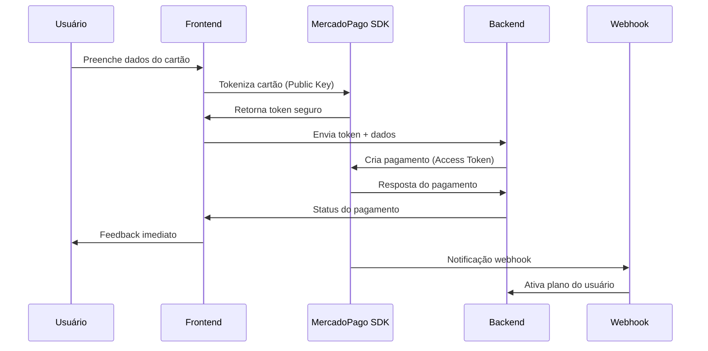
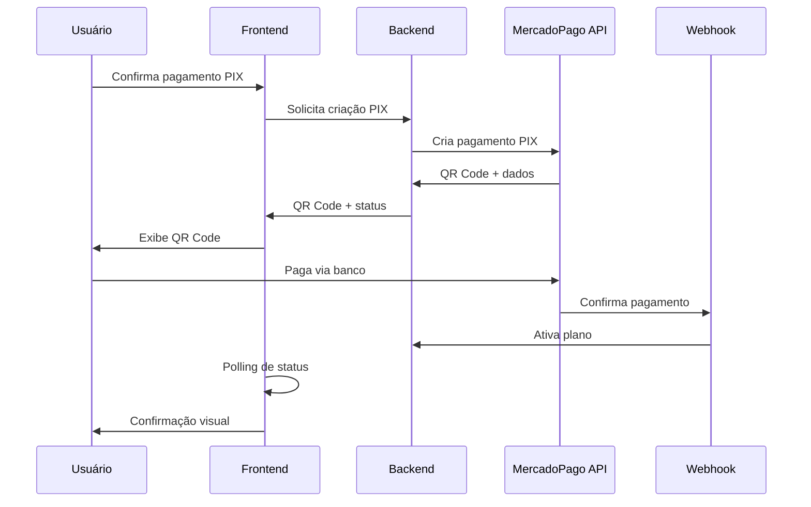

# Migração para Checkout Transparente - Mercado Pago

## 📋 Visão Geral

Este documento detalha a migração completa do **Checkout Pro** (redirecionamento) para **Checkout Transparente** (pagamento na própria página) do Mercado Pago, mantendo total compatibilidade com o sistema atual.

## 🎯 Objetivos da Migração

- ✅ **Melhor UX**: Pagamento sem redirecionamento
- ✅ **Maior conversão**: Processo mais fluido
- ✅ **Controle visual**: Interface integrada ao design
- ✅ **Compatibilidade**: Sistema webhook preservado
- ✅ **Rollback seguro**: Feature flag para alternância

## 🏗️ Arquitetura Implementada

### **Backend (Deno/TypeScript)**
```
supabase/functions/
├── create-transparent-payment/     # Novo: Cria pagamentos diretos
├── get-payment-status/            # Novo: Consulta status
└── mercadopago-webhook-public/    # Mantido: Webhook existente
```

### **Frontend (React/TypeScript)**
```
src/components/payment/
├── TransparentCheckout.tsx        # Componente principal
├── CardPaymentForm.tsx           # Formulário de cartão
├── PixPaymentForm.tsx            # Formulário PIX
├── PaymentStatusTracker.tsx      # Rastreamento de status
├── PaymentMigrationToggle.tsx    # Feature flag
└── UnifiedPaymentButton.tsx      # Interface unificada (atualizada)
```

### **Serviços**
```
src/services/
├── transparentPaymentService.ts   # Novo: API transparente
└── mercadopagoService.ts         # Mantido: Checkout Pro
```

## 🔧 Configuração

### **1. Variáveis de Ambiente**

#### **Obrigatórias:**
```env
# Backend (existente)
VITE_MERCADOPAGO_ACCESS_TOKEN=APP_USR_xxxxx

# Frontend (NOVA - solicitar ao usuário)
VITE_MERCADOPAGO_PUBLIC_KEY=APP_USR_xxxxx
```

#### **Opcionais (Feature Flags):**
```env
# Habilitar Checkout Transparente
VITE_ENABLE_TRANSPARENT_CHECKOUT=true

# Modo padrão (classic | transparent)
VITE_DEFAULT_PAYMENT_MODE=transparent

# Debug (desenvolvimento)
VITE_DEBUG_PAYMENT=true

# Forçar valores para testes
VITE_MP_FORCE_AMOUNT=1.00
VITE_MP_MIN_AMOUNT=1.00
```

### **2. Dependências Instaladas**
```bash
npm install @mercadopago/sdk-js
```

## 🚀 Como Usar

### **Uso Básico (Automático)**
O sistema escolhe automaticamente entre Checkout Pro e Transparente baseado nas configurações:

```tsx
import UnifiedPaymentButton from '@/components/payment/UnifiedPaymentButton';

<UnifiedPaymentButton
  planType="professional"
  planName="Estudante"
  planPrice="R$ 18,99"
  planPeriod="mês"
  onSuccess={() => console.log('Pagamento aprovado')}
  onError={(error) => console.error('Erro:', error)}
/>
```

### **Uso com Feature Flags**
```tsx
<UnifiedPaymentButton
  // ... props
  forceTransparent={true}  // Força Checkout Transparente
  forceClassic={true}      // Força Checkout Pro
/>
```

### **Uso Direto do Checkout Transparente**
```tsx
import TransparentCheckout from '@/components/payment/TransparentCheckout';

<TransparentCheckout
  planType="professional"
  planName="Estudante"
  planPrice="R$ 18,99"
  planPeriod="mês"
  onSuccess={() => console.log('Aprovado')}
  onError={(error) => console.error('Erro:', error)}
/>
```

## 🔄 Processo de Migração

### **Fase 1: Configuração Inicial**
1. **Solicitar credenciais** do Mercado Pago:
   ```
   Public Key: APP_USR_xxxxx
   Access Token: APP_USR_xxxxx (pode ser o mesmo atual)
   ```

2. **Configurar variáveis** de ambiente:
   ```env
   VITE_MERCADOPAGO_PUBLIC_KEY=APP_USR_xxxxx
   VITE_ENABLE_TRANSPARENT_CHECKOUT=true
   VITE_DEFAULT_PAYMENT_MODE=classic  # Começar conservador
   ```

3. **Deploy dos endpoints** backend:
   ```bash
   supabase functions deploy create-transparent-payment
   supabase functions deploy get-payment-status
   ```

### **Fase 2: Testes em Desenvolvimento**
```env
VITE_DEBUG_PAYMENT=true
VITE_DEFAULT_PAYMENT_MODE=transparent
```

- ✅ Testar pagamento com cartão
- ✅ Testar pagamento PIX
- ✅ Validar webhook (deve funcionar igual)
- ✅ Verificar ativação de planos

### **Fase 3: Rollout Gradual**
```env
# Produção - Modo conservador
VITE_ENABLE_TRANSPARENT_CHECKOUT=true
VITE_DEFAULT_PAYMENT_MODE=classic
```

- Usuários podem optar pelo transparente via debug panel
- Monitorar métricas de conversão
- Coletar feedback

### **Fase 4: Migração Completa**
```env
VITE_DEFAULT_PAYMENT_MODE=transparent
```

- Modo transparente como padrão
- Checkout Pro como fallback

## 📊 Comparação: Pro vs Transparente

| Aspecto | Checkout Pro | Checkout Transparente |
|---------|--------------|----------------------|
| **Redirecionamento** | ✅ Sim (externa) | ❌ Não (mesma página) |
| **Controle Visual** | ❌ Limitado | ✅ Total |
| **Métodos Suportados** | ✅ Todos | ✅ Cartão + PIX |
| **Webhook** | ✅ Mesmo atual | ✅ Mesmo atual |
| **UX** | ⚠️ Boa | ✅ Excelente |
| **Estabilidade** | ✅ Testado | ⚠️ Novo |
| **Conversão** | ⚠️ Padrão | ✅ Maior |

## 🔍 Fluxos de Pagamento

### **Checkout Transparente - Cartão**


### **Checkout Transparente - PIX**


## 🛡️ Segurança

### **Separação de Credenciais**
- **Public Key**: Frontend (pode ser exposta)
- **Access Token**: Backend (nunca expor)

### **Validações Implementadas**
- ✅ Validação client-side (UX)
- ✅ Validação server-side (segurança)
- ✅ Sanitização de inputs
- ✅ Rate limiting (via Supabase)
- ✅ Idempotency keys

### **Tratamento de Erros**
- ✅ Fallback para valores mínimos
- ✅ Retry logic para falhas temporárias
- ✅ Logs detalhados para debug
- ✅ Feedback claro para usuário

## 🧪 Testes

### **Cartões de Teste (Sandbox)**
```javascript
// Visa aprovado
4037371641007021

// Mastercard rejeitado
5295551672879843

// CVV: 123
// Vencimento: qualquer data futura
```

### **PIX de Teste**
```javascript
// Valor: R$ 1,00 (configurável via VITE_MP_FORCE_AMOUNT)
// Status: pending → approved (automático em sandbox)
```

### **Cenários de Teste**
1. ✅ Pagamento aprovado (cartão/PIX)
2. ✅ Pagamento rejeitado
3. ✅ Timeout de PIX
4. ✅ Webhook funcionando
5. ✅ Ativação de plano
6. ✅ Feature flag alternando

## 📈 Monitoramento

### **Métricas Importantes**
- **Taxa de conversão**: Pro vs Transparente
- **Tempo de checkout**: Medição completa
- **Abandono**: Onde usuários desistem
- **Erros**: Frequência e tipos
- **Métodos preferidos**: Cartão vs PIX

### **Logs para Acompanhar**
```javascript
// Frontend
console.log('💳 Payment created:', paymentResult);
console.log('✅ Status updated:', statusUpdate);

// Backend
console.log('💳 Creating transparent payment:', paymentData);
console.log('🔍 Getting payment status for:', paymentId);
```

## 🚨 Troubleshooting

### **Problemas Comuns**

#### **SDK não carrega**
```javascript
// Verificar se Public Key está configurada
console.log('Public Key:', import.meta.env.VITE_MERCADOPAGO_PUBLIC_KEY);

// Verificar se MercadoPago está disponível
console.log('MercadoPago SDK:', window.MercadoPago);
```

#### **Pagamento não criado**
```javascript
// Verificar Access Token no backend
console.log('Access Token:', process.env.VITE_MERCADOPAGO_ACCESS_TOKEN);

// Verificar logs da Edge Function
supabase functions logs create-transparent-payment
```

#### **Webhook não recebido**
```javascript
// Verificar URL do webhook
console.log('Webhook URL:', `${functionsUrl}/mercadopago-webhook-public`);

// Testar webhook manualmente
curl -X POST "https://seu-projeto.supabase.co/functions/v1/mercadopago-webhook-public" \
  -H "Content-Type: application/json" \
  -d '{"type":"payment","data":{"id":"123"}}'
```

### **Debug Panel**
O sistema inclui um painel de debug que mostra em desenvolvimento:
- ✅ Configurações atuais
- ✅ Estado das variáveis de ambiente
- ✅ Modo de pagamento ativo
- ✅ Controles para alternância

## 🔄 Rollback Plan

### **Rollback Rápido**
```env
# Desabilitar transparente
VITE_ENABLE_TRANSPARENT_CHECKOUT=false
# ou
VITE_DEFAULT_PAYMENT_MODE=classic
```

### **Rollback Completo**
1. Reverter `UnifiedPaymentButton.tsx` para usar `MercadoPagoButton`
2. Remover novas Edge Functions (opcional)
3. Manter webhook inalterado

## 📝 Checklist de Deploy

### **Pré-Deploy**
- [ ] Public Key configurada
- [ ] Access Token funcionando
- [ ] Endpoints backend deployados
- [ ] Testes em sandbox passando
- [ ] Feature flags configuradas

### **Deploy**
- [ ] Deploy frontend com novos componentes
- [ ] Verificar webhook funcionando
- [ ] Testar pagamento end-to-end
- [ ] Monitorar logs de erro
- [ ] Verificar ativação de planos

### **Pós-Deploy**
- [ ] Métricas de conversão
- [ ] Feedback de usuários
- [ ] Performance monitoring
- [ ] Ajustes de UX se necessário

## 🎉 Benefícios Esperados

### **Para o Usuário**
- ⚡ Checkout mais rápido
- 🎨 Interface integrada
- 📱 Melhor experiência mobile
- ✅ Feedback imediato

### **Para o Negócio**
- 📈 Maior taxa de conversão
- 💡 Melhor controle do funil
- 🎯 UX personalizada
- 📊 Métricas mais detalhadas

### **Para o Desenvolvimento**
- 🔧 Maior flexibilidade
- 🐛 Debug mais fácil
- 🚀 Evolução contínua
- 🔒 Segurança mantida

---

## 📞 Próximos Passos

1. **Solicitar credenciais** do Mercado Pago (Public Key)
2. **Configurar ambiente** de desenvolvimento
3. **Testar funcionalidades** básicas
4. **Deploy gradual** com monitoramento
5. **Otimizar** baseado em feedback

> **Importante**: Esta migração foi projetada para ser **100% compatível** com o sistema atual. O webhook e o sistema de ativação de planos **permanecem inalterados**.
